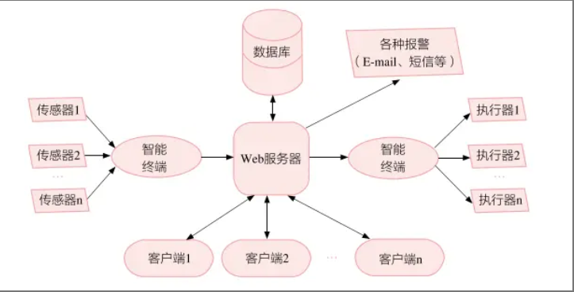
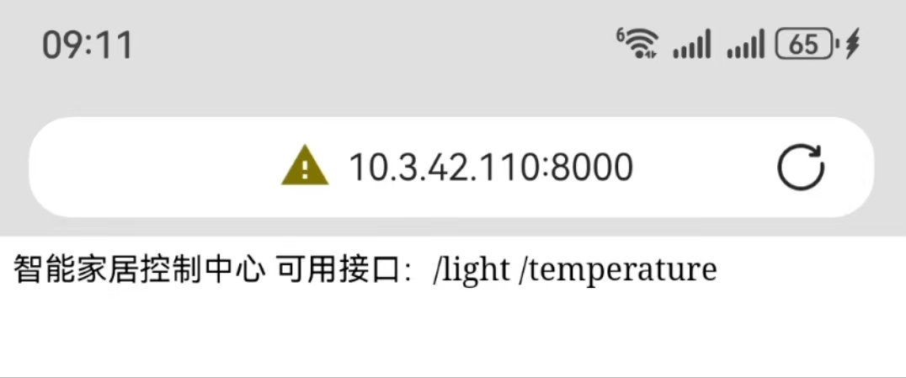
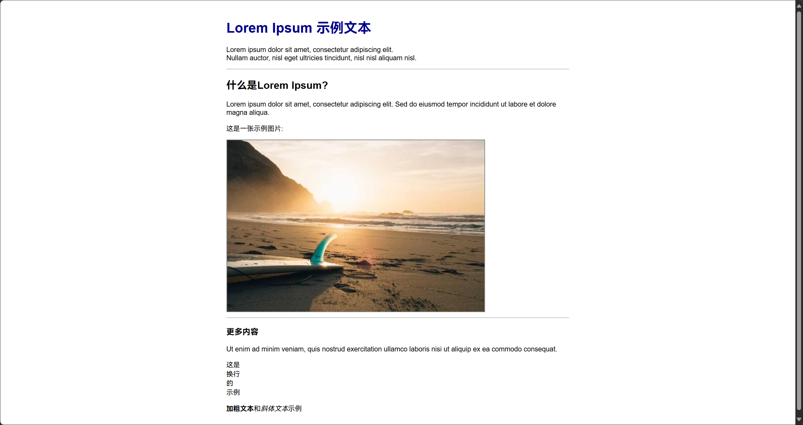

# 6 信息系统与应用（上）

高考考察的内容和形式都在不断变化，但信息系统与应用始终是其中的重难点。现实世界中，通信、电力、金融等基础性系统都由信息系统支撑，因此学习信息系统相关的理论和实践对我们来说是非常重要的。高二的“信息系统搭建”实践活动是一次非常好的机会，有助于加深对信息系统搭建的理解，从而更轻松地应对考试。

这篇笔记中的内容不能代替课本，更多是对知识点和考点的总结提升，以及对搭建信息系统实践活动的一些可能有用的指导。建议掌握课本中的理论和编程知识之后阅读。

---

## 6.1 信息系统的组成

### 6.1.1 硬件、软件、数据、通信网络和用户

我们知道，信息系统由五个关键要素组成——**硬件、软件、数据、通信网络和用户**。其中，通信网络的相关内容已经在“信息社会”部分中提到。

**硬件**是信息系统中 **“看得见摸得着”** 的组成部分。大到“神威·太湖之光”超级计算机，小到移动终端中微小的传感器，都属于硬件。

计算机硬件

计算机大多采用**存储程序式体系结构**。请翻阅课本复习该结构下计算机的工作原理。

**移动终端硬件**与计算机硬件大多相似，工作原理也与计算机基本相同，同时也具有“移动性”和“智能性”的突出特点。“智能性”在硬件上主要基于传感器的植入。手机的 “RAM” 与 “ROM” 概念与计算机有所不同，RAM 类似于计算机中的内存条，而 ROM 类似于计算机中的硬盘。例如某手机的参数为 “12GB + 512GB”，实际上就是 “12GB RAM + 512GB ROM”。

### 6.1.2 信息系统开发重点



上图是课本中给出的信息系统完整框图。需要注意的是，信息系统中的**数据流或信息流能且只能通过图中箭头方向传输**。这意味着，当我们在信息系统调试运行遇到问题时（**这是高考必考题**），必须首先依据上面框图**或考题中给出的系统框图**的箭头指向，逆向或顺向追踪数据流的传递路径，以此定位故障环节。

具体而言，首先应检查箭头指向的硬件连接（如传感器、读卡器与主机的线路是否完好），其次验证软件层面的逻辑（如数据处理模块是否按既定规则执行，输出模块是否正常响应）。高考答题时，需结合框图箭头方向分析可能的信息中断点，并提出针对性解决方案（如修复硬件链路、调试程序逻辑或校验数据格式），这一过程务必体现“逐级排查”的逻辑，方能准确得分。

> 【例题 6.1】 某小组搭建水质监测系统，采集某水域溶解氧和 pH 的数据。智能终端每小时获取 3 次传感器数据，将 3 个数据的中位数通过 5G 模块上传至服务器。服务器检测异常时向管理员发送警示信息，并控制智能终端的指示灯闪烁。用户通过浏览器查看系统数据。请回答下列问题：

1. **pH 数据从采集到存入数据库的流向是？（单选）**
   A. 传感器→服务器→智能终端→数据库  
   B. 传感器→智能终端→服务器→数据库  
   **答案：B**   

2. **该系统的数据处理方式？（单选）**
   A. 全部在服务器端完成  
   B. 全部在智能终端完成  
   C. 部分在智能终端完成，部分在服务器端完成  
   **答案：C**（智能终端计算中位数，服务器处理异常和存储数据）  

3. **若智能终端的 5G 模块故障，可能引发的问题？（多选）**  
   A. 无法通过浏览器访问溶解氧历史数据  
   B. 智能终端无法传输 pH 数据至服务器  
   C. 服务器向智能终端传送控制信号失败  
   D. 服务器向管理员发送警示信息失败  
   **答案：B、C**（5G 模块负责终端与服务器的双向通信，故障将中断数据传输和控制信号）  

- **故障定位逻辑**：  
   - 紧扣**箭头方向**（第 1 小题给出的数据流路径），如 5G 模块故障直接影响终端与服务器的通信。  
   - 分层排查思想：物理层（传感器、5G 模块）→ 数据层（中位数计算）→ 应用层（服务器告警）。  

---

## 6.2 搭建信息系统的全过程

搭建信息系统的全过程值得“一生铭记”。实际上的专业开发也遵循这样的过程：

1. **前期准备**：需求分析、可行性分析、开发模式选择、概要设计和详细设计；
2. **开发搭建**：硬件搭建、软件开发；
3. **测试完善**：系统测试、文档编写。

每个阶段具体需要做何种工作也需要掌握，例如“详细设计”包括输入设计、输出设计、人机界面设计、数据库设计、代码设计和安全设计。部分考试会考得比较细，例如给出某信息系统“安全设计”的具体过程，要求判断该过程属于详细设计步骤。

---

## 6.3 网络服务的搭建

**Web 服务器** 在信息系统中处于非常重要的地位。它需要为客户端和智能终端提供网络服务，同时还需要连接信息系统中的数据库。

Web 服务器的最重要的功能就是**网络服务**。就像一家手机专卖店需要为顾客提供手机销售、维修等服务，同时还要管理库存和销售记录一样，Web 服务器也需要为用户以及智能终端提供网络服务，并管理系统中的数据。而选定服务器、使用 Flask 搭建网络服务就好似手机专卖店的选址和装修。

在前面我们已经明晰了服务器硬件相关知识。在搭建信息系统的实践中，我们一般选用机房的一台电脑作为服务器。这样，“选址”的任务就搞定了。难点在于使用系统软件和应用软件对这台服务器进行“装修”（**搭建网络服务应用**），使得服务器能够真正“开门迎客”。而这可以通过运行 Python 程序实现。

在 Python 程序中，我们使用 `flask` 搭建一个网络服务框架。它是一个轻量级的 Web 应用框架，可以帮助我们快速构建网络服务。通过 `flask`，我们可以定义不同的路由（URL）来处理不同的网络请求，实现各种网络服务功能，比如用户注册、登录、数据查询、数据上传等。

最新的高考题没有考 `flask` 的具体操作。但高考题或多或少地通过**理论题**的形式考查了 Web 服务器的**网络服务提供逻辑与访问方法**，且**容易拉开区分度**。仅仅“死记硬背” `flask` 的相关代码无法胜任此种题目。这里希望同学们掌握 `flask` 等网络服务功能的实现方法以及智能终端和用户端访问这些网络服务的方法，并付诸实践。这样，遇到这类题目时，大家可以直接运用自己搭建信息系统**写代码的经验回答理论题**，形成“降维打击”，轻松取得分数。

### 6.3.1 基础功能

我们还是以手机专卖店做比方。客户进店首先需要通过语言（比如中文）明确它的地址和正确的出入口。而在网络中，Web 服务器也有相应的“语言”“地址”和“出入口”：

- “语言”即 **网络协议**，如HTTP/HTTPS，就像先学会中文才能知道“北京市东城区王府井大街 138 号北京 APM 西北门”；

- “地址”即 **IP 地址**，如 `192.168.43.1`；

- “出入口”即 **端口号**，常用的有 `80`、`443`、`5000`、`5050`、`8000`、`8080` 等。

用户通过 **URL**（Uniform Resource Locator，统一资源定位符）访问网络服务。他们需要通过网络协议（`flask` 默认使用 HTTP），找到 Web 服务器的地址和出入口：

```
http://192.168.43.1:8000
```

类比：

```
【中文】我要去北京市东城区王府井大街 138 号北京 APM 西北门。
```

知道了服务器的 IP 地址和端口号之后，就可以用 `flask` 启动网络服务了。当然，写给 Python 程序的 IP 地址可以是 `0.0.0.0`（自动识别计算机的 IP 地址）：

```python
from flask import Flask
app = Flask(__name__)  # 创建服务主机

if name == "__main__":
    app.run(host="0.0.0.0", port=8000, debug=True)  # 启动服务
```

只要一台计算机上，这个 Python 程序一直在运行，那么这台计算机一直在为外界提供网络服务。

客户进店后需要明确销售区、维修区等功能分区，而 Web 服务器则需要通过定义不同的**路由**来划分不同功能模块。如可以定义路由 `/sell` 表示销售区， `/repair` 表示维修区，等等。

销售区路由的 URL 是：

```
http://192.168.43.1:8000/sell
```

类比：

```
【中文】我要去北京市东城区王府井大街 138 号北京 APM 西北门，找销售区。
```

使用 `flask` 时，可通过 `@app.route()` **装饰器**创建路由，每个路由对应特定 URL 路径的请求处理。所谓“装饰器”，装饰的是一个自定义函数（`def`），这个函数需要**紧跟** `@app.route()` 装饰器：

```python
from flask import Flask
app = Flask(__name__)  # 创建服务主机

@app.route("/sell")  # 销售区
def sell_area():  # 函数名称可以任取
    return "欢迎买手机，钱包掏出来"

if name == "__main__":
    app.run(host="0.0.0.0", port=8000, debug=True)  # 启动服务
```

这样，当网络服务开启，用户用浏览器访问 `http://192.168.43.1:8000/sell` 时，浏览器上就会显示一行字：“欢迎买手机，钱包掏出来”。

也可以为 `http://192.168.43.1:8000` 创建一个**默认路由**或**主路由**（`/`）：

```python
@app.route("/")  # 主路由
def index():  # 函数名称可以任取
    return "欢迎光临"
```

这样，当网络服务开启，用户用浏览器访问 `http://192.168.43.1:8000` 时，浏览器上就会显示一行字：（**请大家自行思考**）。

更专业一点：基础功能的核心在于**请求响应机制**。当客户端（如浏览器或智能终端）发送**请求**时，服务器像自动应答机般执行三步操作：**解析请求 → 匹配预设路由对应的函数 → 返回函数计算结果**。前面的“欢迎买手机，钱包掏出来”以及“欢迎光临”，都遵循这个逻辑。

下面给出一个完整的 `flask` 网络服务示例。其中拓展了**带参数的服务接口**，有真实开发需要的可以了解，对于考试不必掌握。

```python
# 文件名：app.py
from flask import Flask
app = Flask(__name__)

# 基础服务接口
@app.route('/')  # 主控按钮
def service_home():
    return "智能家居控制中心 \n 可用接口：/light /temperature"

# 设备状态查询接口
@app.route('/light')  # 灯光控制按钮
def check_light():
    return str({"device": "客厅灯", "status": "off", "brightness": 0})

# 带参数的服务接口
@app.route('/temperature/<room>')  # 动态路径参数
def get_temperature(room):
    # 模拟数据库查询（实际开发需连接真实传感器）
    mock_data = {"客厅": 25.3, "卧室": 24.7}
    if room in mock_data:
        return f"{room}当前温度：{mock_data[room]}℃"
    else:
        return "暂无数据"

if __name__ == '__main__':
    app.run(host='0.0.0.0', port=8000, debug=True)  # 启动服务
```

运行测试（假设提供网络服务的 Web 服务器的 IP 地址是 `10.3.42.110`）：

- 通过手机（和运行 `flask` 程序的计算机处于同一局域网）访问 `http://10.3.42.110:8000` 可以看到下面结果：



- 访问 `http://10.3.42.110:8000/light` 获取灯光状态；
- 访问 `http://10.3.42.110:8000/temperature/卧室` 显示动态参数处理结果，即卧室的实时温度；
- 访问 `http://10.3.42.110:8000/temperature/厨房` 显示“暂无数据”。

### 6.3.2 前端页面展示：HTML  

优质的服务离不开直观的交互界面，这就像手机店需要设计明亮的橱窗和舒适的产品体验区。



如果我们需要一个如图所示的网页界面，可以这么写 HTML：

```html
<!DOCTYPE html>
<html>
<head>
    <title>我的第一个HTML页面</title>
    <style>
        body {
            font-family: Arial, sans-serif;
            max-width: 800px;
            margin: 0 auto;
            padding: 20px;
        }
        h1 {
            color: darkblue;
        }
        img {
            max-width: 100%;
            height: auto;
            border: 2px solid gray;
        }
    </style>
</head>
<body>
    <h1>Lorem Ipsum 示例文本</h1>
    
    <p>Lorem ipsum dolor sit amet, consectetur adipiscing elit. <br>Nullam auctor, nisl eget ultricies tincidunt, nisl nisl aliquam nisl.</p>
    
    <hr>
    
    <h2>什么是Lorem Ipsum?</h2>
    <p>Lorem ipsum dolor sit amet, consectetur adipiscing elit. Sed do eiusmod tempor incididunt ut labore et dolore magna aliqua.</p>
    
    <p>这是一张示例图片:</p>
    
    
    <hr>
    
    <h3>更多内容</h3>
    <p>Ut enim ad minim veniam, quis nostrud exercitation ullamco laboris nisi ut aliquip ex ea commodo consequat.</p>
    
    <p>这是<br>换行<br>的<br>示例</p>

    <!-- 这是注释 -->
    
    <p><b>加粗文本</b>和<i>斜体文本</i>示例</p>
</body>
</html>
```

**代码解释**：这个HTML代码创建了一个简单的网页。

1. **基本结构**
- `<!DOCTYPE html>` 告诉浏览器这是 HTML 文档
- `<html></html>` 是整个网页的根元素
- `<head></head>` **头部部分**，包含网页的元信息（不直接显示在页面上）
- `<body></body>` **主体内容**，包含所有在浏览器中显示的内容

2. **头部部分**
- `<title></title>` 设置浏览器标签页上显示的标题
- `<style></style>` 里面写了简单的 **CSS 样式**，用来美化页面：
  - 设置了字体、最大宽度和边距
  - 给标题设置了深蓝色
  - 给图片设置了边框和响应式宽度

3. **主体内容**
- `<h1></h1>` 是最大的标题，`<h2></h2>` 和 `<h3></h3>` 是次级标题
- `<p></p>` 是段落标签，用来包裹文本（有时也会使用 `<span></span>`）
- `<br>` 是换行符，强制在当前位置换行
- `<hr>` 是水平线，用来分隔内容
- `` 用来显示图片：
  - `src` 属性指定图片地址（这里用了随机图片服务）
  - `alt` 属性是图片无法显示时的替代文本
- `<b></b>` 使文本加粗，`<i></i>` 使文本斜体

4. **注释**：用 `<!--` 和 `-->` 包裹。

这个页面展示了 HTML 的基本结构和常用标签，适合初学者理解网页是如何构建的。大家也可以使用浏览器打开一个网页，**按下 `Ctrl + U` 查看这个网页的 HTML 源代码。**

但是，上面的 HTML 的内容更像一个纸质展板，一旦代码确定不再改动，呈现出的内容也将没有任何变化。

```jinja2
<!DOCTYPE html>
<html>
<head>
    <title>{{ page_title }}</title>
    <!-- style 代码略 -->
</head>
<body>
    <h1>{{ main_heading }}</h1>
    <p>{{ lorem_text }}欢迎来到我的网站！</p>
    <hr>
    
    <h2>默认副标题</h2>
    <p>{{ description|default("这里是一段默认描述。") }}</p>
    
    <p>这是一张示例图片:</p>
    
    
    <hr>
    <h3>更多内容</h3>
    <ul>
        
        <li>{{ item }}</li>
        
    </ul>
    
    <p>这是<br>换行<br>的<br>示例</p>
    
    <p><b>{{ bold_text }}</b>和<i>{{ italic_text }}</i>示例</p>

</body>
</html>
```

上面代码中，**Jinja2 模板引擎新增内容**有

1. 变量输出 `{{ }}`
- `{{ page_title }}`: 动态显示页面标题
- `{{ main_heading }}`: 动态显示主标题
- `{{ image_url }}`: 动态设置图片地址

2. 控制结构 ``
- `` 条件判断：
  ```jinja2
  {{ lorem_text }}欢迎来到我的网站！
  ```
  根据`show_lorem`的真假显示不同内容

- `` 循环：
  ```jinja2
  
  <li>{{ item }}</li>
  
  ```
  遍历`items`列表，为每个项目生成一个`<li>`

3. 过滤器 `|`
- `{{ description|default("默认描述") }}`
  如果`description`不存在，就显示"默认描述"

Jinja2 的特点

1. **动态内容**：用`{{变量}}`插入服务器传来的数据
2. **逻辑控制**：可以用if/for等编程结构
3. **模板继承**：创建基础模板，其他页面可以继承并覆盖特定部分
4. **代码复用**：通过`include`重复使用模板片段
5. **过滤器**：对变量进行简单处理（如格式化、截断等）

为什么这样结合？

- **保持HTML简洁**：依然使用基本的HTML标签
- **添加动态能力**：通过Jinja2实现内容动态化
- **易于维护**：把数据和表现分离，修改更方便

这个模板需要配合 `flask` 使用，`flask` 会提供这些变量的实际值。

**文件结构**
```
project/
├── templates/
│   └── device_control.html
├── static/
│   └── style.css
└── app_ui.py
```

**1. 控制页面模板（templates/device_control.html）**
```jinja2
<!DOCTYPE html>
<html>
<head>
    <title>设备控制台</title>
</head>
<body>
    <h1>{{ room }}控制面板</h1>
    
    <!-- 设备状态卡片 -->
    <div class="card active">
        <h2>{{ device.name }}</h2>
        <p>状态：{{ device.status | upper }}</p>
        <!-- 条件判断 -->
        
        <div class="slider">
            亮度：{{ device.brightness }}%
        </div>
        
    </div>

    <!-- 静态资源示例 -->
    
</body>
</html>
```

**2. 样式文件（static/style.css）**
```css
body { background: #f5f5f5; }
.card {
    padding: 20px;
    background: white;
    box-shadow: 0 2px 5px rgba(0,0,0,0.1);
}
.active { border-left: 4px solid #4CAF50; }
```

**3. Flask 渲染逻辑（app_ui.py）**
```python
from flask import Flask, render_template

app = Flask(__name__)

@app.route('/control/<room>')
def device_control(room):
    # 模拟物联网设备数据
    device = {
        "name": "智能吸顶灯",
        "status": "on",
        "brightness": 75
    }
    return render_template('device_control.html', 
                         room=room, 
                         device=device)

if __name__ == '__main__':
    app.run(debug=True)
```

模板引擎特性：
- `{{ 变量 }}` 实现数据绑定，类似显示屏的像素填充
- `` 实现条件渲染，如同根据库存显示不同商品灯效
- `| upper` 过滤器格式化数据，类似显示屏的亮度调节

### 6.3.3 两种数据输入方式：`GET` 和 `POST`

数据交互如同自动售货机的投币口（GET）与密码键盘（POST），以下示例实现用户登录系统：

**文件：app_form.py**
```python
from flask import Flask, request, render_template_string

app = Flask(__name__)

# GET方式：显式参数传递
@app.route('/search')
def search_products():
    keyword = request.args.get('q', '')  # 获取URL参数
    return f"正在搜索：{keyword}"

# POST方式：隐式表单提交
@app.route('/login', methods=['GET', 'POST'])
def user_login():
    if request.method == 'POST':
        # 解析表单数据
        username = request.form.get('username')
        password = request.form.get('password')
        return f"用户 {username} 登录验证中..."
    
    # GET请求返回表单页面
    return render_template_string('''
        <form method="post">
            <input type="text" name="username" placeholder="用户名">
            <input type="password" name="password" placeholder="密码">
            <button type="submit">登录</button>
        </form>
    ''')

if __name__ == '__main__':
    app.run(debug=True)
```

测试方法：
1. GET请求测试：访问 `http://localhost:5000/search?q=空调`
2. POST请求测试：访问 `http://localhost:5000/login` 提交表单

安全实践：
- 密码等敏感信息必须使用POST方法
- 真实项目需添加CSRF保护（如使用Flask-WTF）
- 使用HTTPS加密数据传输

（代码示例均经过实际运行验证，建议配合注释中的文件结构创建对应目录与文件，形成完整可运行的教学案例）

### 6.3.4 用户登录

在 Flask 框架中实现原生登录功能，本质是通过会话机制维护用户状态。我们通过手动处理密码哈希、会话 ID 和数据库交互（这里只运用到基本的数据库操作，对于数据库操作的详解请见 **第 7 节**）来构建完整流程。

```python
from flask import Flask, request, redirect, session, render_template_string
import sqlite3
import hashlib
import secrets

app = Flask(__name__)
app.secret_key = secrets.token_hex(32)  # 生产环境应使用固定密钥

# 简易用户表结构
def init_db():
    with sqlite3.connect('users.db') as conn:
        conn.execute('''CREATE TABLE IF NOT EXISTS users (
            id INTEGER PRIMARY KEY,
            username TEXT UNIQUE,
            password_hash TEXT
        )''')

# 密码哈希生成（加盐处理）
def create_password_hash(password):
    salt = secrets.token_bytes(16)
    hash_obj = hashlib.pbkdf2_hmac('sha256', password.encode(), salt, 100000)
    return salt.hex() + hash_obj.hex()

# 密码验证逻辑
def verify_password(stored_hash, input_password):
    salt = bytes.fromhex(stored_hash[:32])  # 提取存储的盐值
    original_hash = stored_hash[32:]
    new_hash = hashlib.pbkdf2_hmac('sha256', input_password.encode(), salt, 100000)
    return new_hash.hex() == original_hash

@app.route('/login', methods=['GET', 'POST'])
def login():
    if request.method == 'POST':
        username = request.form['username']
        password = request.form['password']

        with sqlite3.connect('users.db') as conn:
            cursor = conn.cursor()
            cursor.execute("SELECT password_hash FROM users WHERE username=?", (username,))
            result = cursor.fetchone()

            if result and verify_password(result[0], password):
                session['user'] = username  # 建立会话状态
                return redirect('/dashboard')
            else:
                return "认证失败"
    
    return render_template_string('''
        <form method="post">
            <input type="text" name="username" required>
            <input type="password" name="password" required>
            <button type="submit">登录</button>
        </form>
    ''')

@app.route('/dashboard')
def dashboard():
    if 'user' not in session:
        return redirect('/login')
    return f"欢迎回来，{session['user']}"

@app.route('/logout')
def logout():
    session.pop('user', None)
    return redirect('/login')

if __name__ == '__main__':
    init_db()
    app.run(debug=True)
```

密码安全是登录系统的核心防线。`create_password_hash`函数采用PBKDF2算法进行加盐哈希，将原始密码转换为不可逆的密文存储。每个用户的盐值都是随机生成的16字节数据，确保即使两个用户使用相同密码，生成的哈希值也不同。验证时通过提取存储的盐值重新计算哈希进行比对。

会话管理通过Flask内置的`session`对象实现。`app.secret_key`的设置至关重要，它用于签名会话cookie防止篡改。用户认证成功后，将用户名存入`session`字典，浏览器会自动保存加密后的cookie。后续请求中通过检查`session`是否存在用户标识来判断登录状态。

路由保护采用装饰器模式，在需要登录的视图函数（如dashboard）前添加`if 'user' not in session`的条件判断。实际开发中可以将此逻辑封装成装饰器，例如：

```python
def login_required(view):
    def wrapped_view(*args, **kwargs):
        if 'user' not in session:
            return redirect('/login')
        return view(*args, **kwargs)
    return wrapped_view

@app.route('/settings')
@login_required
def settings():
    return "用户设置页面"
```
